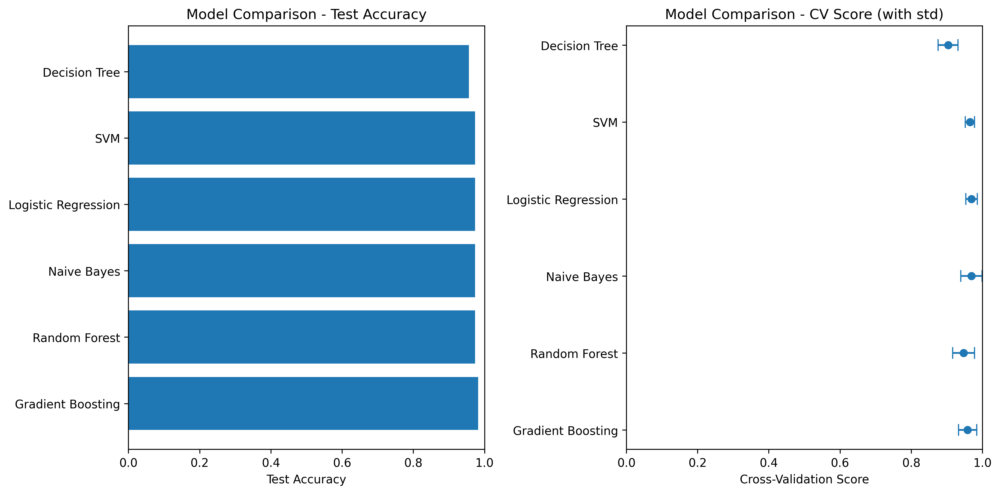

Transaction Purpose Classification
A complete machine learning system for classifying financial transactions based on their purpose text descriptions.
Overview
This project implements a text classification system that can predict transaction types (rent, groceries, utilities, etc.) based on transaction purpose descriptions. The system includes:

Data preprocessing and analysis
Multiple classical ML models
Model comparison and evaluation

# How to use:
In the terminal run:

python run_model_comparison.py --analyze-data --test-model

# Results:

## Transaction Classification Model Training Report
**Generated on:** 2025-07-16 11:31:12

## Files Generated
transaction_model.pkl
transaction_vectorizer.pkl
model_metadata.pkl

## Best Model
- **Model:** Gradient Boosting
- **Type:** GradientBoostingClassifier

Dataset loaded with 600 rows
Columns: ['purpose_text', 'transaction_type']
Original dataset size: 600
After removing missing values: 570
After text cleaning: 570

Class distribution:
transaction_type
groceries         72
utilities         67
dining            59
transportation    58
shopping          57
entertainment     54
rent              54
subscription      52
healthcare        49
travel            48

MODEL COMPARISON RESULTS

              Model  Test Accuracy  CV Mean  CV Std
  Gradient Boosting         0.9825   0.9583  0.0255
      Random Forest         0.9737   0.9473  0.0306
        Naive Bayes         0.9737   0.9693  0.0298
Logistic Regression         0.9737   0.9693  0.0161
                SVM         0.9737   0.9649  0.0128
      Decision Tree         0.9561   0.9036  0.0278

Best Model: Gradient Boosting
Best Test Accuracy: 0.9825

Detailed Classification Report for Gradient Boosting:

                precision    recall  f1-score   support

        dining       1.00      1.00      1.00        12
 entertainment       1.00      1.00      1.00        11
     groceries       1.00      1.00      1.00        14
    healthcare       1.00      1.00      1.00        10
          rent       1.00      0.91      0.95        11
      shopping       0.92      1.00      0.96        11
  subscription       1.00      1.00      1.00        10
transportation       1.00      1.00      1.00        12
        travel       0.90      0.90      0.90        10
     utilities       1.00      1.00      1.00        13

      accuracy                           0.98       114
     macro avg       0.98      0.98      0.98       114
  weighted avg       0.98      0.98      0.98       114

##########
 Next Steps
1. Run the API server: `python main.py`
2. Test the API: `python test_api.py`
3. Review the model comparison plot: `model_comparison.png`
